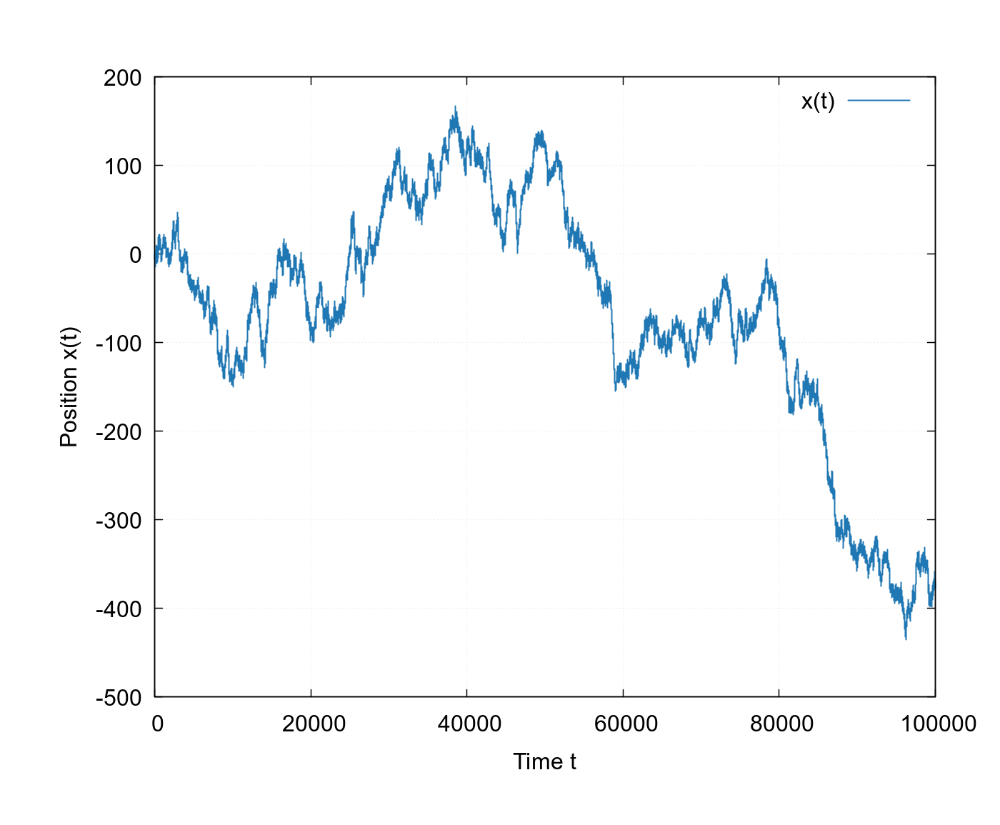
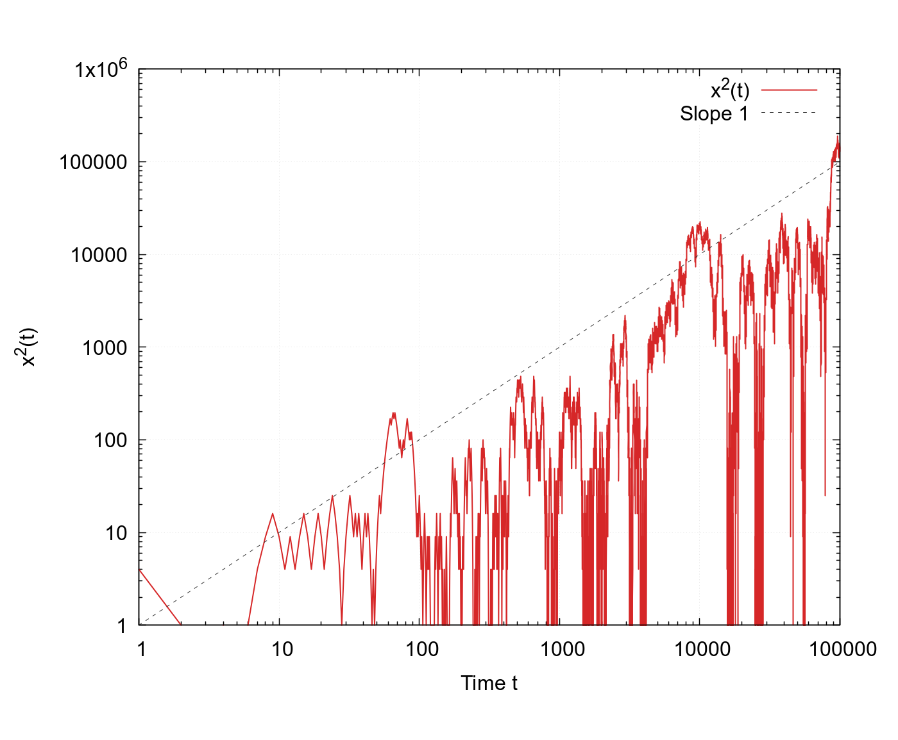
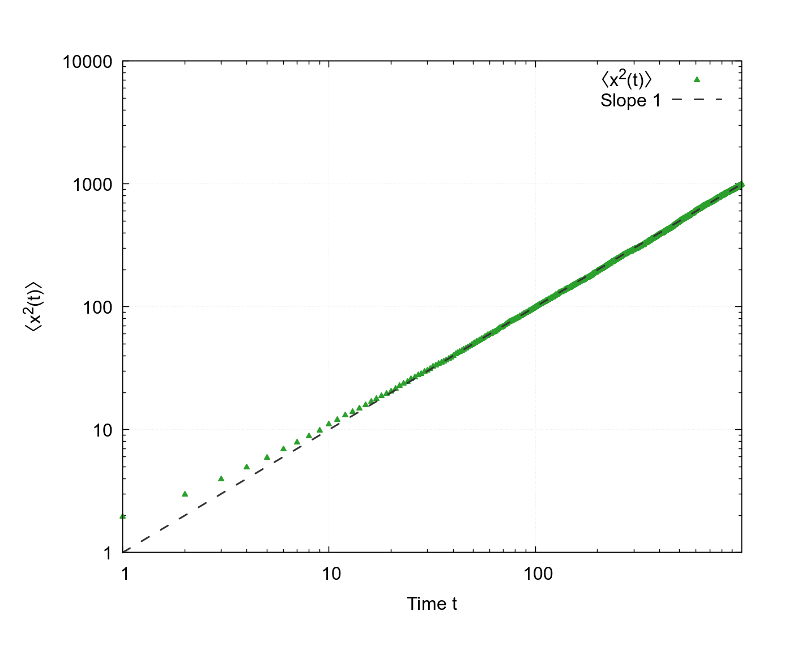
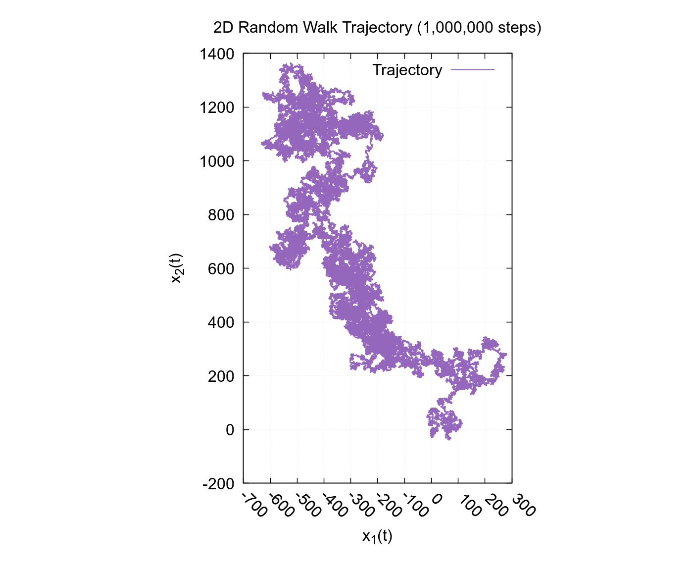
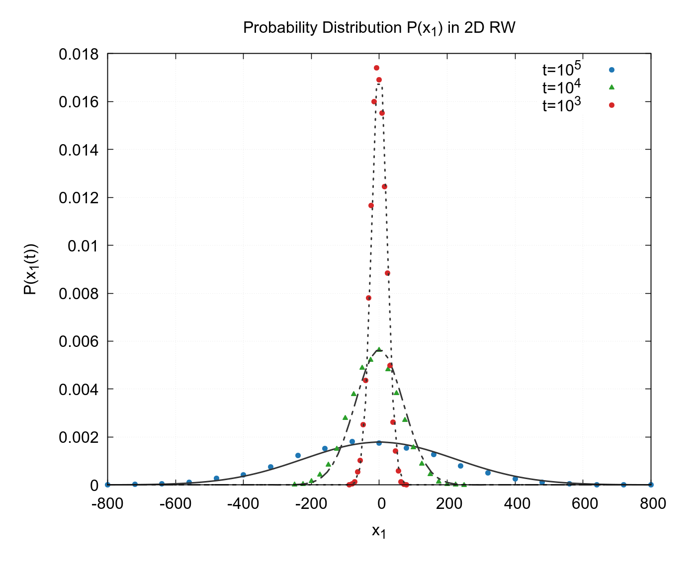
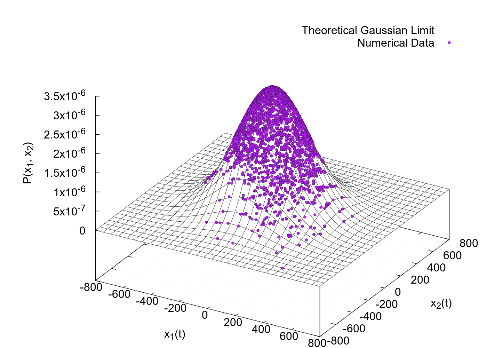
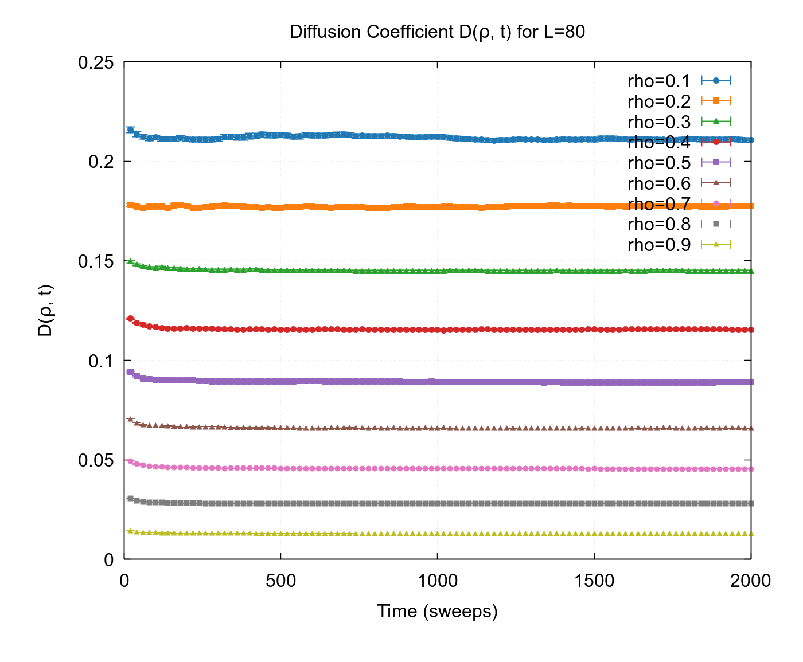
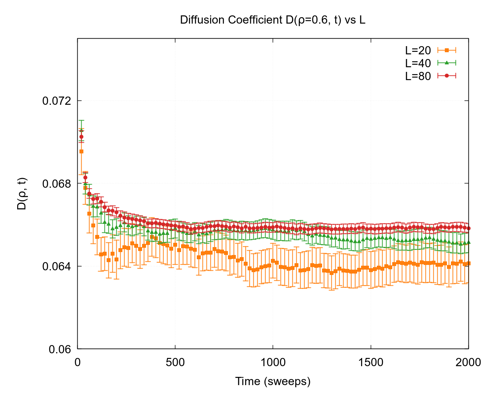

# 🎲 Markov Chains Random Walks

Numerical simulations of **stochastic processes** in C — 1D/2D random walks and lattice gas diffusion — with automated data generation and Gnuplot visualization.

---

## 📁 Project Structure

```
MC_Random_Walks/
├── 01_1d_random_walk/        # 1D random walk: trajectories & ⟨x²(t)⟩
├── 02_2d_random_walk/        # 2D lattice random walk: trajectories & P(x)
├── 03_diffusion_coefficient/ # Lattice gas model: D(ρ,t) measurement
├── generate_data.sh          # Compiles & runs all simulations
├── make_plots.gp             # Gnuplot script for all 8 figures
└── plots/                    # Generated PNG figures
```

## 🔬 Simulations

### 1D Random Walk (`01_1d_random_walk`)
- Symmetric random walk on ℤ with ±1 steps
- Ensemble average ⟨x²(t)⟩ over 5000 independent realizations
- Verification of the diffusive scaling ⟨x²(t)⟩ = t

### 2D Random Walk (`02_2d_random_walk`)
- Lattice random walk on ℤ² with nearest-neighbor steps
- Trajectory visualization over 10⁶ steps
- Marginal distribution P(x₁) at fixed times t = 10³, 10⁴, 10⁵ compared with Gaussian fits
- Joint probability P(x₁, x₂) at t = 10⁵ with theoretical Gaussian surface

### Diffusion Coefficient (`03_diffusion_coefficient`)
- Lattice gas model on a 2D periodic lattice (L×L)
- Measurement of D(ρ, t) = ⟨Δr²⟩ / (4t) with error bars
- Dependence on particle density ρ and lattice size L

All simulations use the **PCG32** pseudo-random number generator for high-quality, reproducible randomness.

---

## 📊 Results

### 1D Random Walk

| Trajectory x(t) | ⟨x²(t)⟩ log-log | ⟨x²(t)⟩ mean |
|:---:|:---:|:---:|
|  |  |  |

### 2D Random Walk

| 2D Trajectory (10⁶ steps) | Marginal P(x₁) |
|:---:|:---:|
|  |  |

| Joint Probability P(x₁, x₂) at t = 10⁵ |
|:---:|
|  |

### Diffusion Coefficient

| D(ρ, t) — varying density ρ | D(ρ, t) — varying lattice size L |
|:---:|:---:|
|  |  |

---

## 🔧 Build & Run

**Prerequisites:** GCC, Gnuplot

```bash
# Generate all data and plots in one step
bash generate_data.sh
gnuplot make_plots.gp
```

Or compile individual simulations:
```bash
cd 01_1d_random_walk
gcc -O3 src/main_dat.c src/seed_generator.c -o program_dat -Iinclude -lm
```

---

## 📖 References

- **Barone, L. M., Marinari, E., Organtini, G., Ricci-Tersenghi, F.**
  *Scientific Programming: C-Language, Algorithms and Models in Science.*
  World Scientific, 2013. ISBN: 978-981-4513-40-1.
